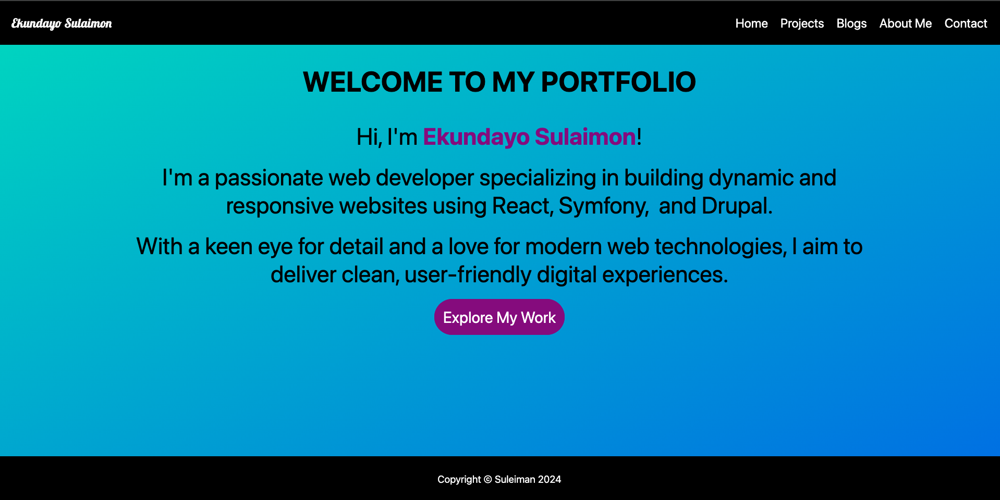

# Headless Drupal Portfolio

## Description

This is a headless Drupal application that serves as a backend for a personal portfolio website. It utilizes Drupal 10 as the CMS to manage content while using react-vite as the frontend framework to display the content dynamically.

## Features

- **Content Management**: Utilize Drupal to create and manage content types such as Projects, Blogs, About Me, and Contact.
- **Responsive Design**: The frontend is built with React and Tailwind CSS and a custom css for a responsive user experience.
- **API Integration**: Fetch data from the Drupal backend using RESTful APIs for seamless content delivery.

## Prerequisites

- [Node.js](https://nodejs.org/) (version 14 or higher)
- Lando set up
- [Drupal 10](https://www.drupal.org/) installed and configured
- Composer (for managing PHP dependencies)

## Installation
1. lando composer install

### Setting Up Drupal

1. **Clone the Drupal and React Repository**:
   ```bash
   git clone https://github.com/ekundayoSO/drupal-final-project.git
   cd drupal-final-project.git


